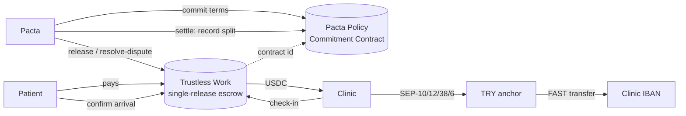

# Pacta

Health-tourism deposits held in escrow until the patient walks into the clinic.
The cancellation schedule is committed on-chain before the patient pays, and the
clinic cashes out in Turkish lira.

A patient abroad books six implants in Istanbul and is asked for an €800 deposit
by bank transfer. If they cancel, the refund depends on the clinic's goodwill.
With Pacta:

1. The patient pays and the deposit is locked in a **Trustless Work** escrow.
2. The refund tiers they saw (14+ days: 100%, 7–14: 50%, <7: 0%) are written to
   the **Pacta Policy Commitment Contract**, bound to that escrow.
3. At the clinic, the front desk checks them in and the patient confirms from a
   QR. The escrow releases.
4. The clinic withdraws USDC to TRY through a SEP-6 **anchor**, at a locked rate.

If the patient cancels instead, Pacta records the split the contract computes and
pays exactly that out of the escrow.

## Architecture



| Role in Trustless Work | Who | Why |
|---|---|---|
| `approver` | Patient | Confirms arrival |
| `serviceProvider` | Clinic | Checks the patient in |
| `releaseSigner`, `platformAddress` | Pacta release key | Releases on dual confirmation; opens cancellations so the patient signs nothing |
| `disputeResolver` | Pacta resolver key (separate) | Pays out cancellations |
| `receiver` | Clinic | |

### Why a policy contract on top of Trustless Work

Trustless Work has no time trigger: every refund is a distribution list the
dispute resolver chooses. Pacta is that resolver, so escrow alone would make the
refund Pacta's decision. The policy contract closes that gap as far as composition
allows:

- **Immutable terms.** One policy per escrow, committed before funding.
- **Public arithmetic.** `distribute(deal, reason, at, balance)` returns the exact
  `resolve-dispute` list — positive amounts, summing to the live balance.
- **A recorded promise.** `settle` stores and emits the split once, before
  Pacta signs the payout. It rejects times before commitment or after the
  current ledger, so a cancellation cannot be moved into a cheaper tier.

This makes a deviation **provable**, not impossible. We say that plainly.

## Repository

| Path | What |
|---|---|
| [`contracts/policy`](contracts/policy) | Policy Commitment Contract (Soroban). 19 tests, incl. a parity vector shared with the TS policy |
| [`web`](web) | Next.js: patient deposit notice, clinic desk, escrow service, Trustless Work + contract clients |
| [`web/lib/policy.ts`](web/lib/policy.ts) | The same policy math in TypeScript; must agree with the contract to the stroop |
| [`anchor`](anchor) | SEP-1/10/12/38/6 client for the USDC ⇄ TRY leg, used by the clinic desk and a CLI |
| [`contracts/upto`](contracts/upto) | x402 `upto` scheme for Stellar — the id derivation Pacta's policy contract inherits |
| [`docs`](docs) | Spec, PRD, competitor map, hackathon strategy |

## Testnet

| | |
|---|---|
| Policy Commitment Contract | [`CBH76LP7DYOMVUKXFKLQGDLLDVIFK6LM7S24BNQQMZ774EIR57TTP7V2`](https://stellar.expert/explorer/testnet/contract/CBH76LP7DYOMVUKXFKLQGDLLDVIFK6LM7S24BNQQMZ774EIR57TTP7V2) |
| Escrow | Trustless Work single-release, deployed per deal |
| Asset | USDC `GBBD47IF…LLFLA5` — the same issuer the anchor settles in |
| Anchor | `tr-mock-anchor.fly.dev` (SEP-6, TRY). Only the bank rail is simulated |

## Run it

```bash
make test                        # contracts
cd web && npm install && npm test

npm run tw -- wallets            # testnet keys for patient, clinic, agency, Pacta ×2
npm run dev                      # http://localhost:3000 and /clinic
```

Without `TW_API_KEY` the site runs the same policy math with simulated escrow and
says so on the page. With it (in `web/.env.local`, from
[dapp.trustlesswork.com](https://dapp.trustlesswork.com)), every step is a
testnet transaction and each one links to the explorer. Live escrows run at 1:100
because the sandbox anchor caps single transfers.

```bash
npm run tw -- arrival 10         # CLI: deploy → commit → fund → check-in → confirm → settle → release
npm run tw -- cancel 10 10       # CLI: … → dispute → settle → resolve, procedure 10 days out
npm run tw -- fund 1500          # buy testnet USDC for the patient through the anchor
npm run tw -- topup              # recycle USDC from clinic and agency back to the patient
npm run tw -- refund <C…>        # return a stuck escrow to the patient
cd ../anchor && npm run demo     # TRY → USDC → TRY through the anchor
```

Deploying the demo to a host: [`docs/deploy.md`](docs/deploy.md).

## Honest scope

| Real | Simulated or out of scope |
|---|---|
| Escrow custody (Trustless Work), policy contract, USDC movement, anchor quotes, SEP-6 withdrawals | The anchor's bank rail; EUR → USDC for the patient |
| Clinic licence number shown on the notice | Live Ministry of Health registry lookup — static list |
| Agency share recorded on-chain | Agency paid by the clinic after release (split contract is next) |
| Full refunds follow the policy to the stroop | Trustless Work deducts a 0.3% protocol fee from each payout, so a 100% refund lands as 99.7% |
| — | Demo keys sign for every role server-side; the product uses an embedded wallet for patients |

## License

Apache-2.0
